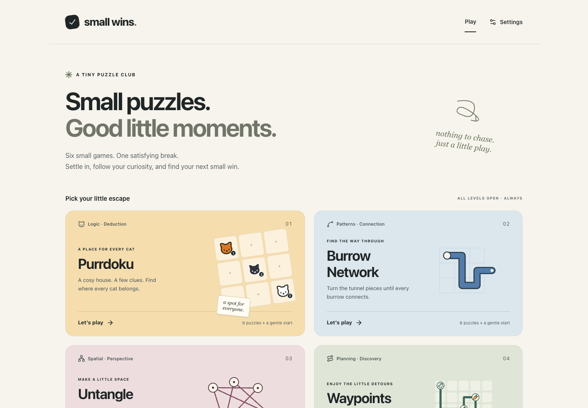
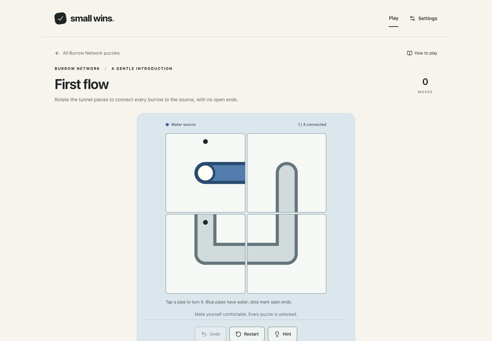
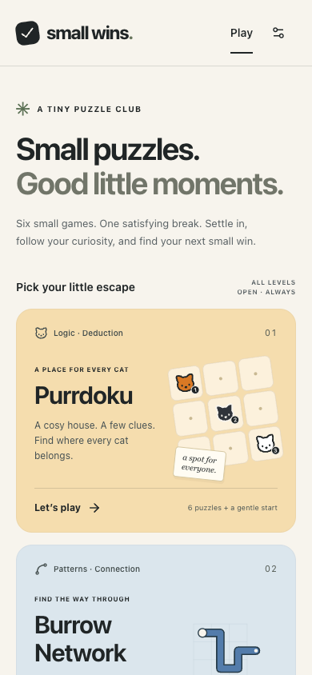

<div align="center">

# Small Wins

### Small puzzles. Good little moments.

A calm, cross-platform puzzle portfolio built around deterministic rules, gentle feedback, and interaction that feels good on both desktop and touch screens.

[**Play the live web demo**](https://kroha22.github.io/small-wins/) · [Browse the games](#the-collection) · [See the mobile status](#mobile-apps)


</div>



## The collection

Small Wins contains six independent games and 42 playable levels, including a gentle introduction for every mechanic.

| Game | Focus | Core interaction |
| --- | --- | --- |
| **Purrdoku** | Logic · Deduction | Place every cat while satisfying row, column, and clue constraints. |
| **Burrow Network** | Patterns · Connection | Rotate tunnel pieces into one complete network with no open ends. |
| **Untangle** | Spatial · Perspective | Move nodes until no lines cross, overlap, or touch another node. |
| **Waypoints** | Planning · Discovery | Collect every carrot and reach the flag without revisiting a cell. |
| **Shikaku** | Spatial · Packing | Divide the board into rectangles that match their clues. |
| **Habitat Search** | Observation · Logic | Find every hidden group and keep a non-destructive map of the search. |

There are no timers, streaks, currencies, or locked levels. Progress is stored locally and every game supports keyboard and pointer input.

## Designed for a moment of calm

<table>
  <tr>
    <td width="68%"></td>
    <td width="32%"></td>
  </tr>
</table>

- Clear rules and reversible actions.
- Progressive hints instead of punishment.
- Accessible names, keyboard navigation, visible focus, and reduced-motion support.
- Responsive layouts designed for desktop and touch-sized screens.
- Seeded generation and explicit solution witnesses where generation is used.

## Architecture

The repository contains one complete web client and a deliberately smaller native vertical slice.

```text
web/
  React UI + TanStack Router
  pure TypeScript game engines
  authored and generated level packs
  local progress and session state

mobile/
  shared/       pure Kotlin rules and catalog models
  composeApp/   shared Android/iOS Compose UI
  androidApp/   thin Android host
  iosApp/       thin SwiftUI host
```

Game rules do not depend on React, Compose, browser storage, platform APIs, ambient time, or implicit randomness. UI state and persistent progress stay outside the engines.

## Mobile apps

The Android and iOS clients use the same Kotlin Multiplatform and Compose Multiplatform approach.

| Area | Status |
| --- | --- |
| KMP project, Gradle wrapper, Android host, and iOS Xcode host | **Implemented** |
| Shared Compose catalog for all six games | **Implemented** |
| Shared deterministic Burrow Network engine | **Implemented** |
| Burrow Network tutorial and first native level | **Implemented** |
| Purrdoku, Untangle, Waypoints, Shikaku, and Habitat Search | **Web only — native ports planned** |
| Android/iOS build and device verification | **Not run yet** |

The native scope stays intentionally honest: one mechanic is ported end to end before the remaining games are moved across.

## Web stack

- React 19, TypeScript 6, Vite 8, and Tailwind CSS 4
- TanStack Router for typed navigation
- Zustand for aggregate progress and settings
- Zod for content validation
- Vitest and Testing Library for rules and UI tests
- Playwright for browser, accessibility, responsive, and interaction checks

## Run locally

```bash
cd web
npm ci
npm run dev
```

The project uses Node.js 24. Useful verification commands:

```bash
npm run typecheck
npm run validate:levels
npm test
npm run build
npm run test:e2e
```

## Deployment

The web portfolio is published to GitHub Pages from `main`. Every deployment installs from the lockfile, runs type checking and unit tests, builds the production bundle, and only then publishes the artifact.

**Live:** https://kroha22.github.io/small-wins/
